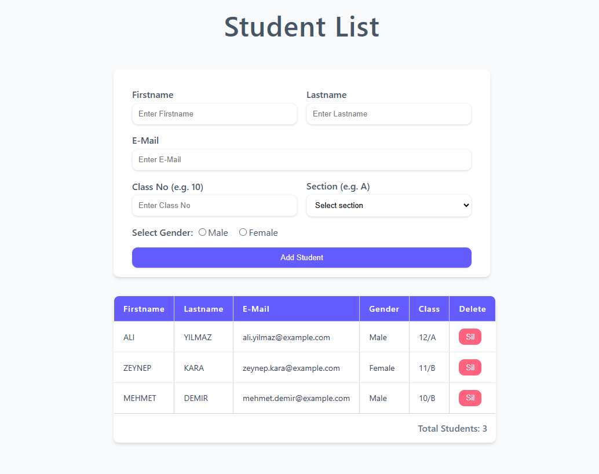
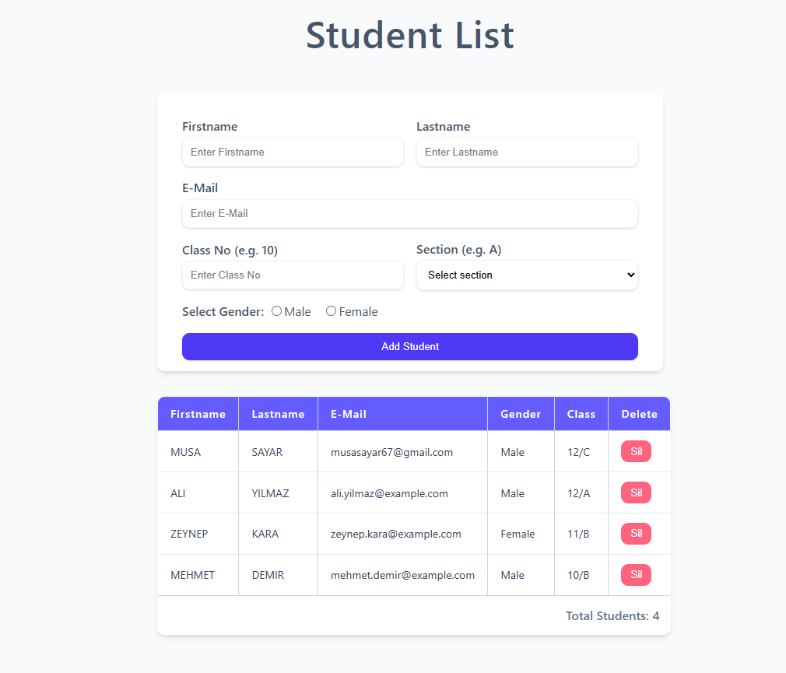
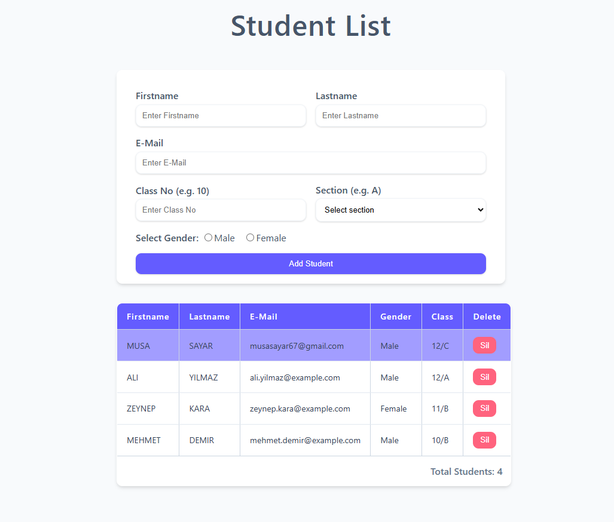
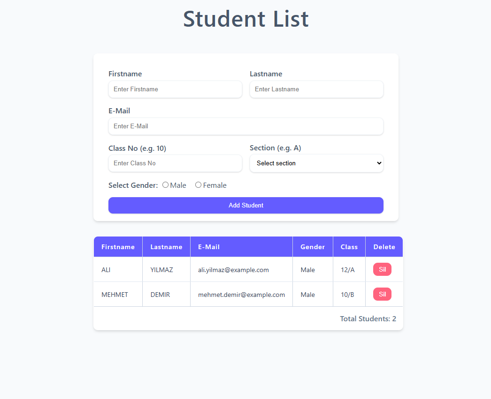

# Student Management Application

## Description

This application allows users to add student information including **first name**, **last name**, **email**, **class**, and **gender**, and display the students in a table. Users can:

- Add new students to the list.
- Delete any student from the table.
- Click on a student row to change its background color for selection indication.

The application is designed to be **responsive** and adapts to different screen sizes. On mobile devices, the **email column is hidden** to improve the viewing experience.

The project is developed using **HTML**, **CSS**, **JavaScript**, and **jQuery**.

---

## Features

- Add student details via a form.
- Display student data dynamically in a table.
- Delete student entries from the table.
- Highlight selected student rows on click.
- Responsive design with mobile-friendly adjustments.

---

## Technologies Used

- HTML5
- CSS3 (with CSS variables and responsive media queries)
- JavaScript (ES6+)
- jQuery

---

## Application Images

| Home Page              | Added Student            |
|------------------------|--------------------------|
|  |  |

| Selected Student       | Deleted Student          |
|------------------------|--------------------------|
|  |  |


---

## Running the Project

Follow the steps below to download and run the project on your local machine:

### 1. Clone the Repository

```bash
git clone https://github.com/musayar9/Insider_code_craft_jquery_homework1.git
```

### 2. Navigate to the Project Folder

```bash
cd Insider_code_craft_jquery_homework1
```


---

### 3. Open in Browser

You can open the `index.html` file by double-clicking it or using a live server (e.g., VSCode Live Server).
